# simPl Reader

**A quiet place for your books.**

A native, offline reader for **PDF, EPUB, HTML, text and Markdown**, built with Rust for Windows x64.
Keep a local library, pick up where you stopped, and read in a minimal interface
with light and dark themes. Listen with Windows voices, look up words offline,
and keep your highlights and notes with your books.


[Get started](#get-started) · [Reading modes](#reading-modes) · [Shortcuts](#shortcuts) · [Build from source](#build-from-source) · [Development](#development) · [License](#license)

## Made for reading

- **Your library, on your machine.** Import documents, mark favourites, search by
  title or author, and resume from Continue Reading.
- **Two ways to read PDFs.** Keep the original page in Document view or use Book
  view for reconstructed prose and extracted illustrations.
- **One page at a time.** Visible paper boundaries, previous/next navigation and a
  page field that can jump across the whole book.
- **Stable pages.** Zoom changes the size of the page without changing its number
  or the total. Switching PDF views keeps your current source page.
- **Reading themes.** Pick Default, Soft, Clear or Compact in Settings: each sets the
  reading font, line and paragraph spacing, and its own light and dark colors. Page
  numbers and page boundaries stay the same in every theme, and text size stays your
  own. All fonts are bundled, so nothing is downloaded.
- **Reading comfort.** Fit Book pages to the available width or press F11 for fullscreen. Pick font, text size, line spacing and side margins independently; settings for an open reflowable book are remembered for that book, and library changes set defaults.
- **Listen and follow along.** Windows' installed voices read continuously across pages and EPUB chapters. The viewport follows the spoken line, and a temporary word highlight shows your place. Pause, resume and adjust the speed; select Listen again to stop.
- **Offline word lookup.** Double-click a word or select → right-click → Translate. Choose your language pair and automatic lookup preference. Download only the dictionaries you need; the 13 optional directions cover English, Turkish, Spanish, German, French, Japanese, Korean and Chinese. Lookup works locally after installation.
- **Make the book yours.** Bookmark pages, highlight passages in four colors, and add notes. Revisit them in the sidebar or export them for use elsewhere.
- **Portable reading data.** Create and restore verified library backups, and export bookmarks, quotes and notes as Markdown, text or JSON from Settings → Library & data.
- **Less chrome.** Collapse the toolbar to reclaim reading space. Choose Windows- or
  macOS-style window buttons in Settings. Geist for the interface, Literata (or the
  theme's font) for the book, and bundled fonts for offline reading.
- **Keyboard access.** Navigate controls, switch books, turn pages and copy selected
  text without reaching for the mouse.

## Your workspace

| Light | Dark |
| --- | --- |
| 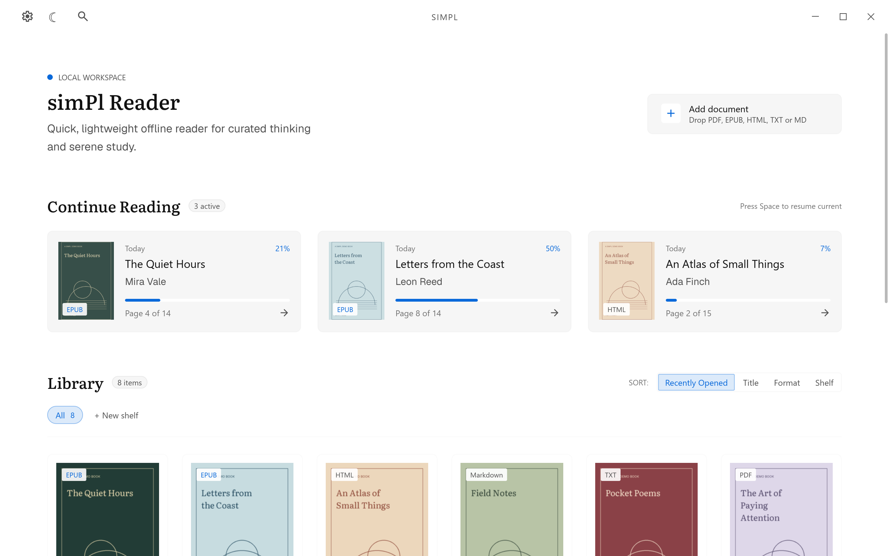 | 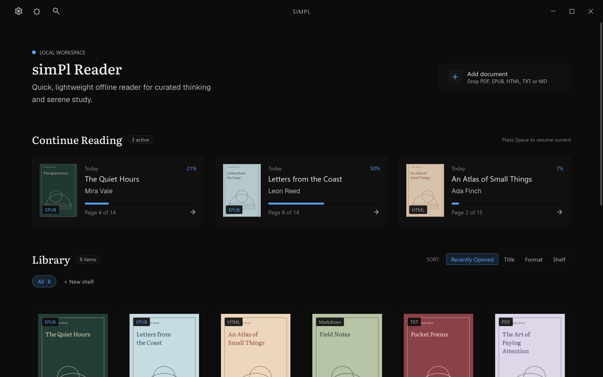 |

Import EPUB, PDF, HTML, TXT and Markdown, search your library, organize shelves,
and return to Continue Reading. The original demonstration books shown here are
not included with the application.

## Find your reading style

Four reading themes, each with light and dark colors. Typography preferences and
zoom are independent, so you can make the page comfortable while keeping its place.

| Soft · light | Clear · light |
| --- | --- |
| 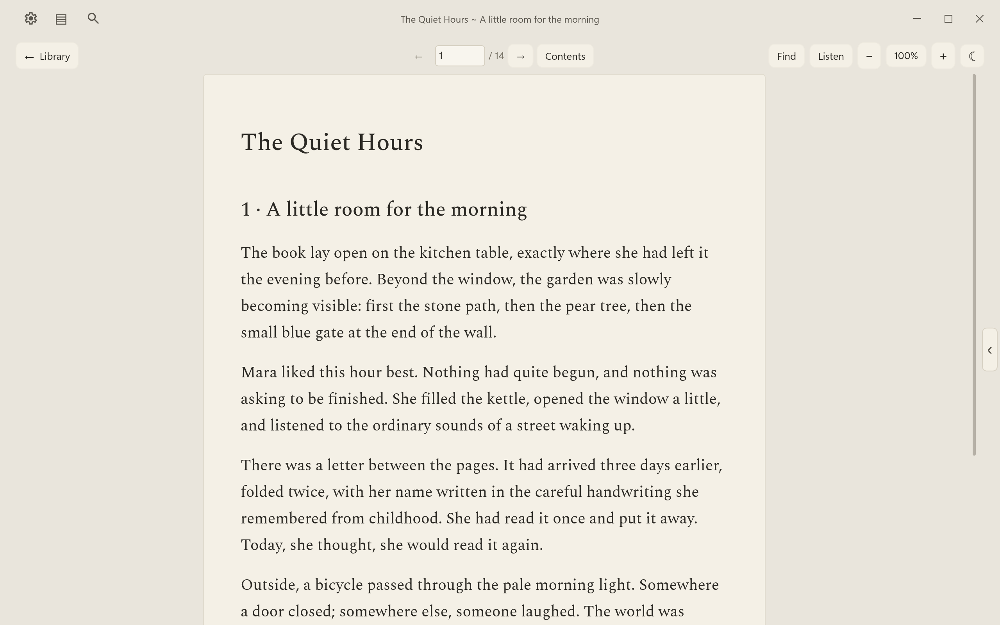 | 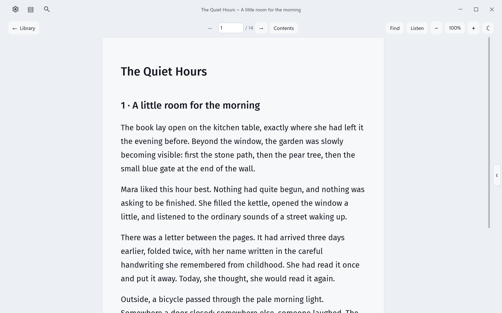 |

| Compact · dark | Fullscreen |
| --- | --- |
| 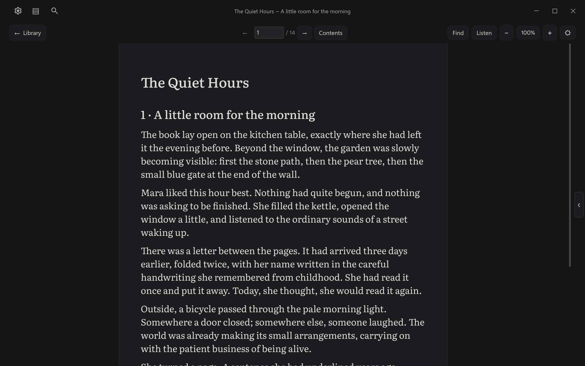 | 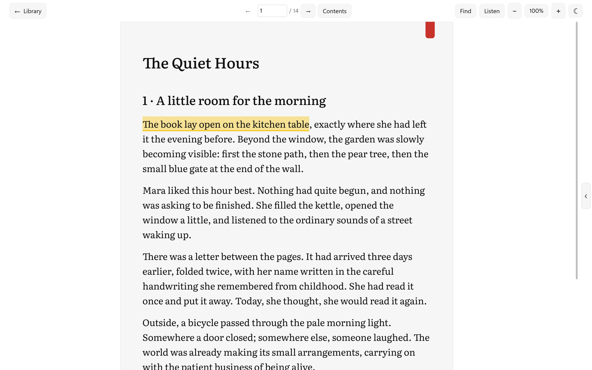 |

## Read, listen, remember

| Highlights and notes | Offline word translation |
| --- | --- |
| 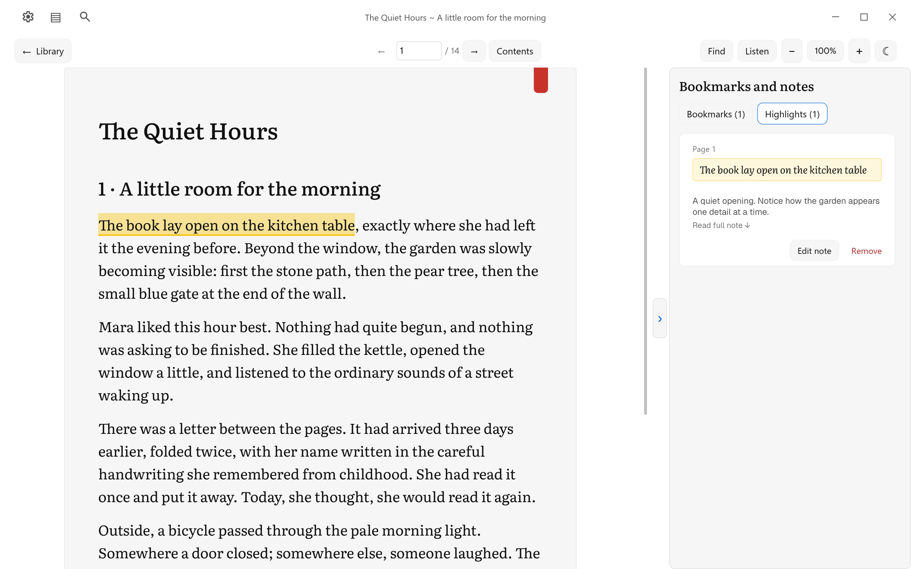 | 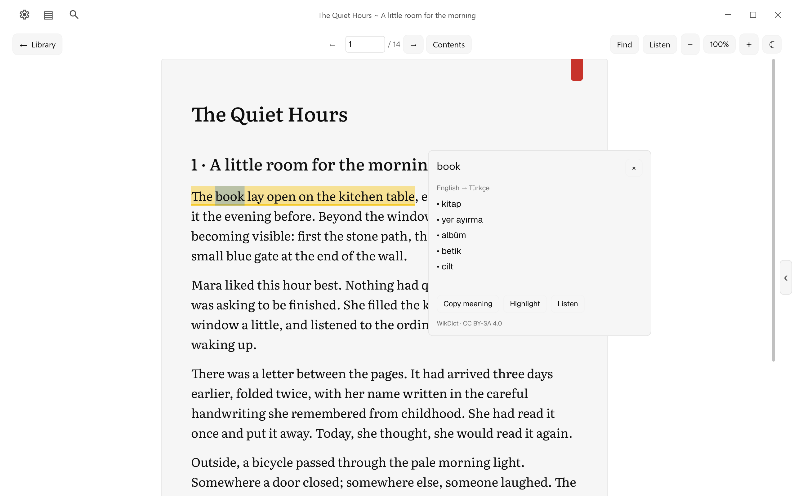 |

Dictionary content in the translation image: [WikDict](https://www.wikdict.com/page/about)
by Karl Bartel, from [Wiktionary contributors](https://www.wiktionary.org/) via
[DBnary](https://kaiko.getalp.org/about-dbnary/), under
[CC BY-SA 4.0](https://creativecommons.org/licenses/by-sa/4.0/).
simPl normalizes and excerpts the data. [Full attribution and website reuse](docs/screenshots/ATTRIBUTION.md).

| Listen with word tracking | Download the dictionaries you need |
| --- | --- |
| 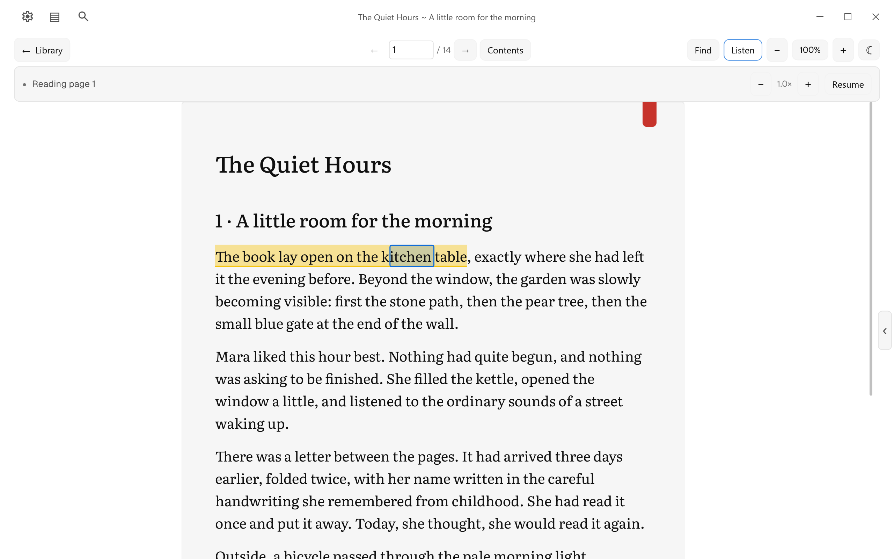 | 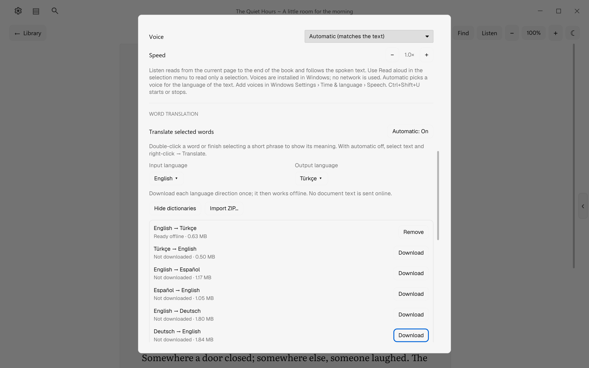 |

| PDF · Document | PDF · Book |
| --- | --- |
| 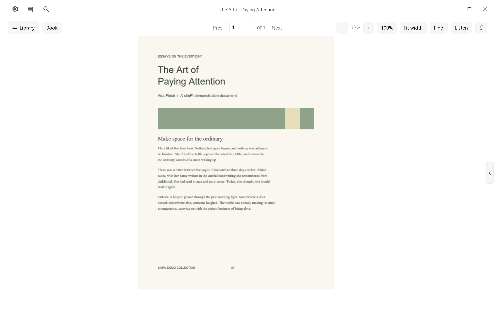 | 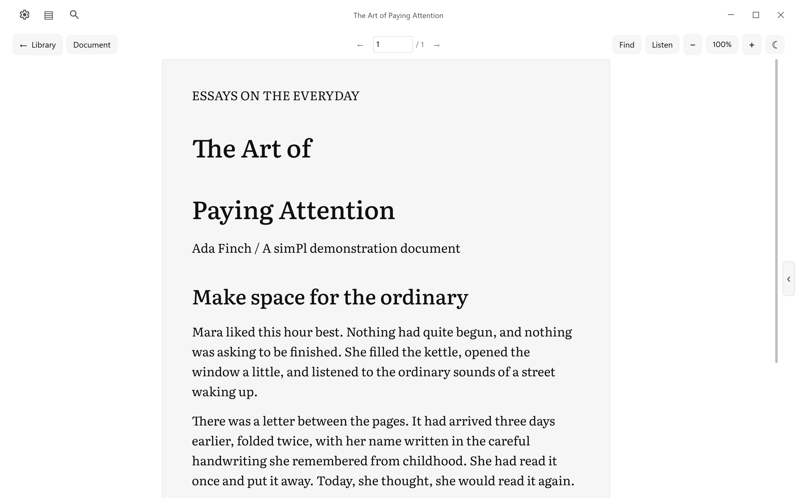 |

| Reading settings | Back up your library |
| --- | --- |
| 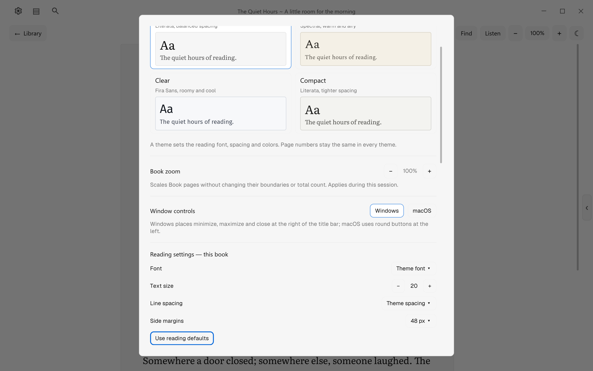 | 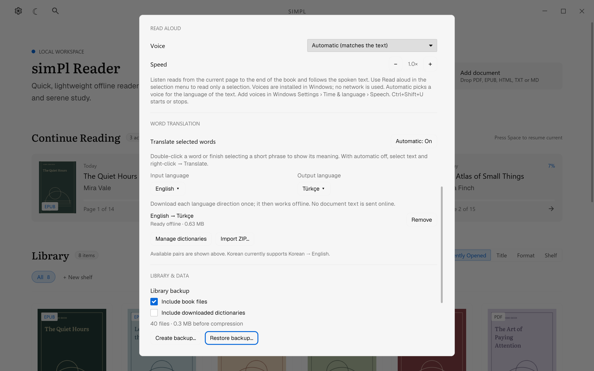 |

[Full-resolution PNGs, lossless WebP copies and media details](docs/screenshots/README.md)
are available for websites and promotion; [download the media kit with updated
attribution](https://github.com/Tikkaaa3/simPl-reader/releases/download/v0.1.5/simPl-0.1.5-promotional-media-attributed.zip).
These are full-window renders of the
production interface at 2560 × 1600, using an isolated demo library; they are
not OS desktop captures. No controls or features were composited into the images.

## Get started

**[Download simPl 0.1.5 for Windows x64](https://github.com/Tikkaaa3/simPl-reader/releases/tag/v0.1.5)**
— installer and portable ZIP. See the [release notes](docs/releases/0.1.5.md)
for changes since 0.1.4.

The current target is **Windows x64**. The setup package is named
`simPl-<version>-windows-x64-setup.exe`. It installs for your Windows account, offers
desktop and Start menu shortcuts, and registers an uninstaller in Windows Settings.
When uninstalling, you can keep your library or delete simPl's imported copies and
reading data. Original files outside the library are left untouched.

To build the setup package, see the [installer guide](installer/README.md).
To create the portable application, follow [Build from source](#build-from-source).
If you already have a portable folder:

1. Run `simPl.exe`. Keep `pdfium.dll` and the `third-party` folder beside it.
2. Select **Add Document**, press **Ctrl+O**, or drop a supported file into the window.
3. Read, then return to **Library**. Your position and reading preferences are saved.

The portable executable needs no Rust installation. Move or copy the **whole
application folder**, not just the executable. Library data is stored in your
Windows profile rather than beside the executable.

## Reading modes

| Format | What to expect |
| --- | --- |
| **PDF · Document** | Original page layout, images and typography, with text selection, zoom and fit-width. Best for academic papers, tables and complex layouts. |
| **PDF · Book** | Reconstructed text in simPl's reading style, with extracted illustrations and the original source-page count. Switching back to Document keeps the current page. |
| **EPUB** | Reflowable EPUB 2/3, contents navigation, internal links and footnotes. Publisher page lists are used when available. |
| **HTML** | Local UTF-8 HTML/XHTML, supported document structure and local images. HTML book folders can also be imported; scripts and remote resources are not executed or fetched. |
| **TXT · Markdown** | `.txt`, `.md` and `.markdown` files are converted to a private HTML page when imported, then read like HTML. Encodings: UTF-8, UTF-16 with a byte-order mark, or the Windows ANSI code page. Markdown supports headings, emphasis, lists, tables, code, footnotes and local images; the library retains the original TXT or Markdown label. |

Older text imports may lack source-format metadata. Add the original TXT/Markdown
file again to repair its library label while reusing the same managed document.

When EPUB or HTML has no source page list, simPl creates a fixed page map on its
first preparation. The **− / +** controls zoom that map; they do not repaginate it. Select the zoom percentage to toggle **Fit width**, or use **Ctrl+Shift+F**. Fit width follows window and notes-sidebar resizing, and returns to the previous zoom when toggled off.
Arrow keys turn pages, while vertical scrolling stays within the selected Book page.

PDF Book view uses the PDF's existing text layer; it does **not** perform OCR.
Image-only or complex pages may be better read in Document view. Initial preparation
of a large scanned PDF with an existing text layer can take time. Converted content
and illustration regions are cached for subsequent view switches and reopenings.
Blank source pages remain blank.

Select text to choose a highlight color or add a note. Right-click a saved
highlight to change its color, edit its note or remove it. Same-color overlapping
highlights merge without darkening; different colors can overlap. Right-click a
page to bookmark it. The bookmarks and notes sidebar opens from the arrow at
the right edge or with Ctrl+B. Click a note in the sidebar to read its full text;
long notes scroll within the list.
Bookmarks and highlights are stored per book under
`%LOCALAPPDATA%\simPl\annotations\`, so they follow a moved or re-imported file.

Select **Listen** or press **Ctrl+Shift+U** to continue from the current page to the
end of the book, even when text is selected. The player provides pause, resume,
and speed controls. The viewport follows the spoken line, turning pages and
loading the next EPUB chapter automatically.
The spoken word has a temporary accent fill and outline in Book and PDF Document views. Pause keeps it visible; stopping clears it. It does not change selection or saved highlights.
Select **Listen** again or press **Ctrl+Shift+U** to stop.
Use **Read aloud** in the selection menu or on a saved highlight to read only
that passage. Choose a voice and speed in Settings; both are saved. Speech uses
Windows' installed voices
offline. Automatic voice selection estimates the text's language and falls back
to the Windows default. PDF reading needs a permitted text layer; image-only pages
are skipped.

Double-click a word, or finish selecting a short phrase, to open its **offline
translation card**. In Settings → Word translation, choose the input/output
languages and turn automatic lookup on or off. With automatic off, use
selection → right-click → **Translate**. The defaults are automatic lookup and
English → Turkish. Escape, an outside click or page navigation closes the card.
Long passages keep the highlight/note menu. PDFs need selectable text and copy
permission; scanned pages need OCR.

The downloadable pairs are English ↔ Turkish, Spanish, German, French, Japanese
and Chinese, plus Korean → English. Chinese → English includes simplified and
traditional forms. Settings → Word translation shows each direction’s size and
Download/Remove controls; Manage dictionaries lists all 13. A missing-word card
also offers Download and retries the selected word after installation. Downloads
are explicit, support progress/cancel/retry, and send no document text. Import ZIP
installs the same verified packages without a connection. All packages total
19.77 MB; the executable contains only a 5 KB catalog. Installed files stay in
`%LOCALAPPDATA%\simPl\dictionaries` and work offline; only the current direction
is decompressed. Results are dictionary meanings; coverage varies and basic
English base-form fallbacks are labeled. Full sentence translation and Argos
plugins remain future work. [Data sources and license](assets/dictionaries/README.md).

## Library and local data

**Add Document** and file drops copy documents into
`%LOCALAPPDATA%\simPl\documents\`. Reading positions, library metadata, preferences,
cover thumbnails, bookmarks, highlights, notes and disposable conversion/page caches also stay under
`%LOCALAPPDATA%\simPl\`.

Hover a library card to favourite or remove it. Favourites appear in their own
section. Removal asks for confirmation and deletes the application's managed copy;
your original file remains untouched. Back up the `simPl` profile folder if you want
to preserve both the collection and reading state.

Reading is local and offline. Building the application initially needs network
access to obtain dependencies and the pinned PDF runtime.

## Backup and export

Close the book, then open **Settings → Library & data**. A backup includes settings,
shelves, history, reading positions, per-book typography, covers and annotations.
**Include book files** bundles imported library copies and their local resources;
**Include downloaded dictionaries** optionally bundles installed packs. Temporary
page maps and conversion caches are rebuilt. Linked originals outside the simPl
profile are not bundled, and omitted book files may need **Locate** on another PC.
The displayed size is uncompressed; the saved file is a compressed ZIP.

Restore first verifies the archive, shows a review, and requires **Restore and
replace**. It replaces library metadata and settings; directories omitted from
that backup retain their local book files or dictionary packs. Included book paths
and their reading-position keys are remapped to the destination profile. The
previous profile is kept beside the new one in a `.simPl-before-restore-*` recovery
folder. Keep the application closed when manually recovering those folders.
Backup limits are 50,000 files, 512 MiB per file and 16 GiB total.

With a book open, choose **Markdown**, **Text** or **JSON**, then **Export…**.
Exports include bookmarks, highlighted quotes, notes and page/chapter labels;
JSON also preserves their full anchors, IDs and timestamps.

## Shortcuts

| Shortcut | Action |
| --- | --- |
| **Ctrl+O** | Add a document |
| **Ctrl+K** | Search and switch books |
| **Ctrl+W** | Save and return to Library |
| **Space** in Library | Resume the most recent unfinished book when no control is focused |
| **← / →** in Book view | Previous / next page |
| **↑ / ↓**, **Page Up / Page Down** | Scroll within the current Book page |
| **Ctrl+L** | Focus the page field |
| **Ctrl+plus / minus / 0** | Zoom in / out / reset |
| **Ctrl+wheel**, touchpad pinch | Zoom in / out |
| **Ctrl+T** in EPUB | Open contents |
| **Alt+Left** | Return from an internal link |
| **Ctrl+C** | Copy selected text |
| **Ctrl+Shift+U** | Start / stop reading aloud |
| **Ctrl+H** | Highlight selected text with the last used color |
| **Ctrl+D** | Add or remove a bookmark on the current page |
| **Ctrl+B** | Show or hide bookmarks, highlights and notes |
| **Ctrl+Shift+F** | Toggle fit width / previous zoom in Book or PDF Document |
| **F11** | Enter / exit fullscreen; Esc exits after dismissing open panels |
| **F8** | Hide / show the reading toolbar |
| **Tab / Shift+Tab** | Move between controls |
| **F1** | Show shortcut help |

## Build from source

Install **Windows PowerShell 5.1 or later**, **rustup**, and **Visual Studio C++
Build Tools with the Windows SDK**. The repository pins Rust in
[rust-toolchain.toml](rust-toolchain.toml).

From the repository root:

```powershell
# Install the pinned toolchain and developer tools.
rustup toolchain install 1.97.1-x86_64-pc-windows-msvc --profile minimal --component rustfmt,clippy

# Build and launch the reader.
powershell -NoProfile -ExecutionPolicy Bypass -File scripts\dev.ps1 run

# Check formatting, Clippy and workspace tests.
powershell -NoProfile -ExecutionPolicy Bypass -File scripts\dev.ps1 check

# Build a complete portable folder.
powershell -NoProfile -ExecutionPolicy Bypass -File scripts\package.ps1

# Build a website installer (also requires Inno Setup 6.7.3).
powershell -NoProfile -ExecutionPolicy Bypass -File scripts\installer.ps1 -Version 0.1.5
```

The portable output is `target\portable\simPl\simPl.exe`. The scripts initialize
MSVC for their own process, use the lockfile, stage PDFium and collect third-party
notices. Once dependencies and runtime/license caches are populated, add `-Offline`
to the scripts. Close the portable application before replacing its package.

## Development

simPl uses **Iced with the tiny-skia CPU renderer**. The reading interface is native;
it does not embed a browser or WebView.

| Component | Responsibility |
| --- | --- |
| [`iced-shell`](crates/iced-shell) | Library, reader, native window, selection and page layout |
| [`reader-document`](crates/reader-document) | HTML/EPUB parsing, text and Markdown conversion, managed imports and reading state |
| [`reader-pdf`](crates/reader-pdf) | PDFium worker, PDF text/graphics and Book conversion |
| [`reader-workload`](crates/reader-workload) | Authored diagnostic workloads and assets |
| [`process-measure`](crates/process-measure) | Opt-in process measurements |
| [`reader-profile`](crates/reader-profile) | Profile and cache roots shared by the core crates |
| [`reader-ffi`](crates/reader-ffi), [`uniffi-bindgen`](crates/uniffi-bindgen) | Rust core API and binding generator for the Android app in progress ([android/](android/README.md)) |

See the [developer guide](crates/iced-shell/README.md), [project roadmap](roadmap.md),
[Book parser roadmap](book-parser-roadmap.md), and [design reference](design/DESIGN.md).
The [local reader review](reader-release-review-2026-09-30.md) records current
release checks, performance limits and comparisons with other readers.
For changes, run the workspace check and the focused verification relevant to the
affected reader path. For bug reports, include the format, view mode, page number,
steps to reproduce, and a shareable sample if possible.

Independent clean-Windows package qualification is still pending. The roadmaps
record remaining work; this README describes the implemented reader.

## Third-party notices

Fonts and icons are bundled with their [licenses and source notes](assets/licenses).
The portable package also includes PDFium and Rust dependency notices in
`third-party/`. The repository retains a small [Cosmic Text patch](patches/cosmic-text-0.15.0)
for verified RTL text placement; its rationale is in the developer guide.

## License

simPl is **free to use** and **source-available**. It is not open source.

- **The app.** Official releases from the simPl website or
  [GitHub Releases](https://github.com/Tikkaaa3/simPl-reader/releases) are free for
  everyone, including at work and across an organisation. See the
  [terms for official releases](LICENSE-BINARY.txt).
- **The source code** is licensed under the
  [PolyForm Noncommercial License 1.0.0](LICENSE.md). You may study, modify and share
  it for noncommercial purposes. Commercial use of the source, including builds made
  from it, requires a separate license.
- **The name and logo.** "simPl", "simPl Reader" and the simPl logo are not covered
  by either license. Forks must use a different name and logo.

For a commercial license, contact tikkaaa3@gmail.com. Third-party components keep
their own licenses (see [Third-party notices](#third-party-notices)).
