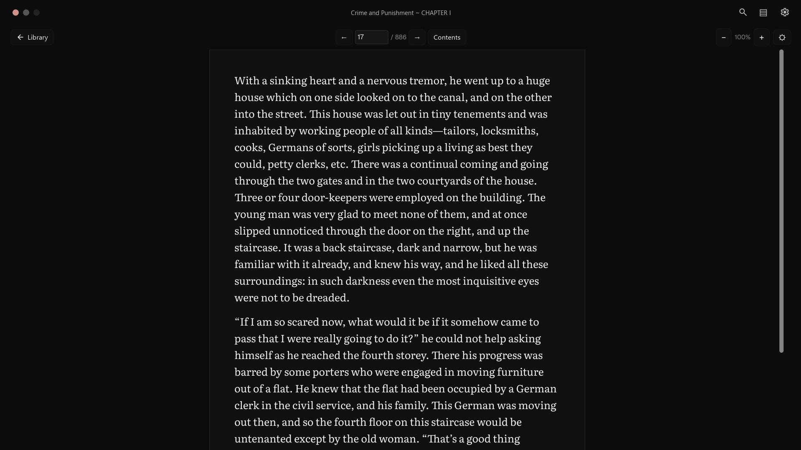
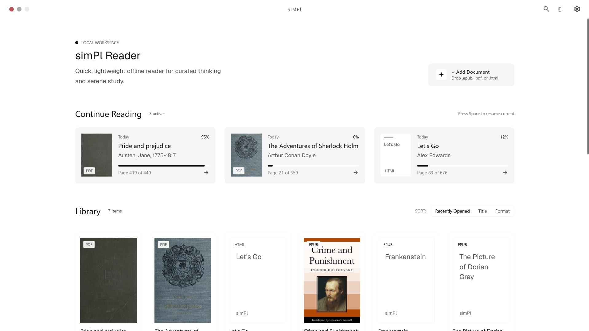

# simPl Reader

**A quiet place for your books.**

A native, offline reader for **PDF, EPUB and HTML**, built with Rust for Windows x64.
Keep a local library, pick up where you stopped, and read in a minimal interface
with light and dark themes.



[Get started](#get-started) · [Reading modes](#reading-modes) · [Shortcuts](#shortcuts) · [Build from source](#build-from-source) · [Development](#development) · [License](#license)

## Made for reading

- **Your library, on your machine.** Import documents, mark favourites, search by
  title or author, and resume from Continue Reading.
- **Two ways to read PDFs.** Keep the original page in Document view or use Book
  view for reconstructed prose and extracted illustrations.
- **One page at a time.** Visible paper boundaries, previous/next navigation and a
  page field that can jump across the whole book.
- **Stable pages.** Zoom changes the size of the page without changing its number
  or the total. Switching PDF views keeps your current source page.
- **Less chrome.** Collapse the toolbar to reclaim reading space. Choose Windows- or
  macOS-style window buttons in Settings. Geist for the interface, Literata for the
  book, and bundled fonts for offline reading.
- **Keyboard access.** Navigate controls, switch books, turn pages and copy selected
  text without reaching for the mouse.

## Your workspace

| Light | Dark |
| --- | --- |
|  |  |

Example libraries shown above. Books are not included with the application.

## Get started

The current target is **Windows x64**. The setup package is
`simPl-0.1.0-windows-x64-setup.exe`. It installs for your Windows account, offers
desktop and Start menu shortcuts, and registers an uninstaller in Windows Settings.
When uninstalling, you can keep your library or delete simPl's imported copies and
reading data. Original files outside the library are left untouched.

To build the setup package, see the [installer guide](installer/README.md).
To create the portable application, follow [Build from source](#build-from-source).
If you already have a portable folder:

1. Run `simPl.exe`. Keep `pdfium.dll` and the `third-party` folder beside it.
2. Select **Add Document**, press **Ctrl+O**, or drop a supported file into the window.
3. Read, then return to **Library**. Your position and reading preferences are saved.

The portable executable needs no Rust installation. Move or copy the **whole
application folder**, not just the executable. Library data is stored in your
Windows profile rather than beside the executable.

## Reading modes

| Format | What to expect |
| --- | --- |
| **PDF · Document** | Original page layout, images and typography, with text selection, zoom and fit-width. Best for academic papers, tables and complex layouts. |
| **PDF · Book** | Reconstructed text in simPl's reading style, with extracted illustrations and the original source-page count. Switching back to Document keeps the current page. |
| **EPUB** | Reflowable EPUB 2/3, contents navigation, internal links and footnotes. Publisher page lists are used when available. |
| **HTML** | Local UTF-8 HTML/XHTML, supported document structure and local images. HTML book folders can also be imported; scripts and remote resources are not executed or fetched. |

When EPUB or HTML has no source page list, simPl creates a fixed page map on its
first preparation. The **− / +** controls zoom that map; they do not repaginate it.
Arrow keys turn pages, while vertical scrolling stays within the selected Book page.

PDF Book view uses the PDF's existing text layer; it does **not** perform OCR.
Image-only or complex pages may be better read in Document view. Initial preparation
of a large scanned PDF with an existing text layer can take time. Converted content
and illustration regions are cached for subsequent view switches and reopenings.
Blank source pages remain blank.

## Library and local data

**Add Document** and file drops copy documents into
`%LOCALAPPDATA%\simPl\documents\`. Reading positions, library metadata, preferences,
cover thumbnails and disposable conversion/page caches also stay under
`%LOCALAPPDATA%\simPl\`.

Hover a library card to favourite or remove it. Favourites appear in their own
section. Removal asks for confirmation and deletes the application's managed copy;
your original file remains untouched. Back up the `simPl` profile folder if you want
to preserve both the collection and reading state.

Reading is local and offline. Building the application initially needs network
access to obtain dependencies and the pinned PDF runtime.

## Shortcuts

| Shortcut | Action |
| --- | --- |
| **Ctrl+O** | Add a document |
| **Ctrl+K** | Search and switch books |
| **Ctrl+W** | Save and return to Library |
| **Space** in Library | Resume the most recent unfinished book when no control is focused |
| **← / →** in Book view | Previous / next page |
| **↑ / ↓**, **Page Up / Page Down** | Scroll within the current Book page |
| **Ctrl+L** | Focus the page field |
| **Ctrl+plus / minus / 0** | Zoom in / out / reset |
| **Ctrl+wheel**, touchpad pinch | Zoom in / out |
| **Ctrl+T** in EPUB | Open contents |
| **Alt+Left** | Return from an internal link |
| **Ctrl+C** | Copy selected text |
| **F8** | Hide / show the reading toolbar |
| **Tab / Shift+Tab** | Move between controls |
| **F1** | Show shortcut help |

## Build from source

Install **Windows PowerShell 5.1 or later**, **rustup**, and **Visual Studio C++
Build Tools with the Windows SDK**. The repository pins Rust in
[rust-toolchain.toml](rust-toolchain.toml).

From the repository root:

```powershell
# Install the pinned toolchain and developer tools.
rustup toolchain install 1.97.1-x86_64-pc-windows-msvc --profile minimal --component rustfmt,clippy

# Build and launch the reader.
powershell -NoProfile -ExecutionPolicy Bypass -File scripts\dev.ps1 run

# Check formatting, Clippy and workspace tests.
powershell -NoProfile -ExecutionPolicy Bypass -File scripts\dev.ps1 check

# Build a complete portable folder.
powershell -NoProfile -ExecutionPolicy Bypass -File scripts\package.ps1

# Build a website installer (also requires Inno Setup 6.7.3).
powershell -NoProfile -ExecutionPolicy Bypass -File scripts\installer.ps1 -Version 0.1.0
```

The portable output is `target\portable\simPl\simPl.exe`. The scripts initialize
MSVC for their own process, use the lockfile, stage PDFium and collect third-party
notices. Once dependencies and runtime/license caches are populated, add `-Offline`
to the scripts. Close the portable application before replacing its package.

## Development

simPl uses **Iced with the tiny-skia CPU renderer**. The reading interface is native;
it does not embed a browser or WebView.

| Component | Responsibility |
| --- | --- |
| [`iced-shell`](crates/iced-shell) | Library, reader, native window, selection and page layout |
| [`reader-document`](crates/reader-document) | HTML/EPUB parsing, managed imports and reading state |
| [`reader-pdf`](crates/reader-pdf) | PDFium worker, PDF text/graphics and Book conversion |
| [`reader-workload`](crates/reader-workload) | Authored diagnostic workloads and assets |
| [`process-measure`](crates/process-measure) | Opt-in process measurements |

See the [developer guide](crates/iced-shell/README.md), [project roadmap](roadmap.md),
[Book parser roadmap](book-parser-roadmap.md), and [design reference](design/DESIGN.md).
For changes, run the workspace check and the focused verification relevant to the
affected reader path. For bug reports, include the format, view mode, page number,
steps to reproduce, and a shareable sample if possible.

Independent clean-Windows package qualification is still pending. The roadmaps
record remaining work; this README describes the implemented reader.

## Third-party notices

Fonts and icons are bundled with their [licenses and source notes](assets/licenses).
The portable package also includes PDFium and Rust dependency notices in
`third-party/`. The repository retains a small [Cosmic Text patch](patches/cosmic-text-0.15.0)
for verified RTL text placement; its rationale is in the developer guide.

## License

simPl is **free to use** and **source-available**. It is not open source.

- **The app.** Official releases from the simPl website or
  [GitHub Releases](https://github.com/Tikkaaa3/simPl-reader/releases) are free for
  everyone, including at work and across an organisation. See the
  [terms for official releases](LICENSE-BINARY.txt).
- **The source code** is licensed under the
  [PolyForm Noncommercial License 1.0.0](LICENSE.md). You may study, modify and share
  it for noncommercial purposes. Commercial use of the source, including builds made
  from it, requires a separate license.
- **The name and logo.** "simPl", "simPl Reader" and the simPl logo are not covered
  by either license. Forks must use a different name and logo.

For a commercial license, contact tikkaaa3@gmail.com. Third-party components keep
their own licenses (see [Third-party notices](#third-party-notices)).
