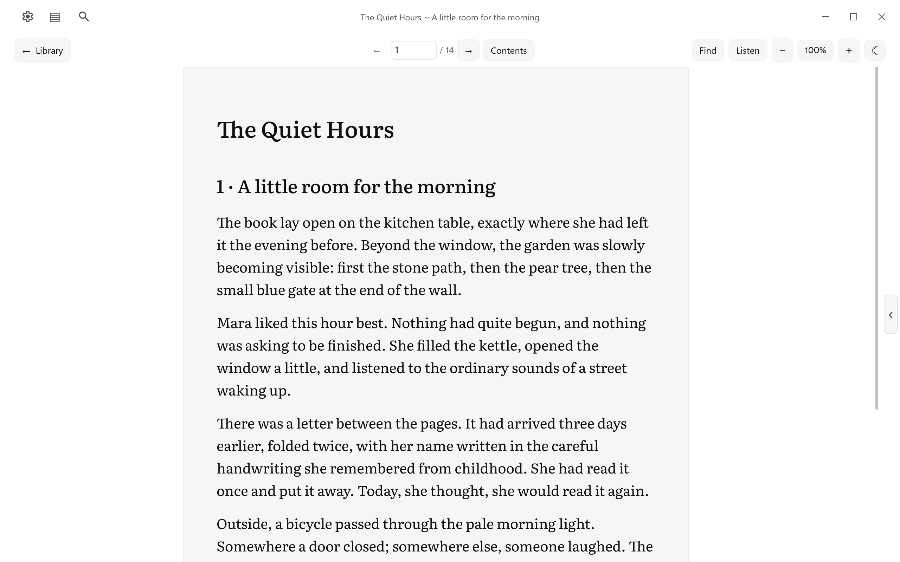
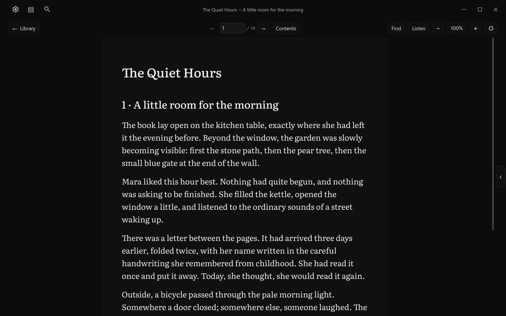
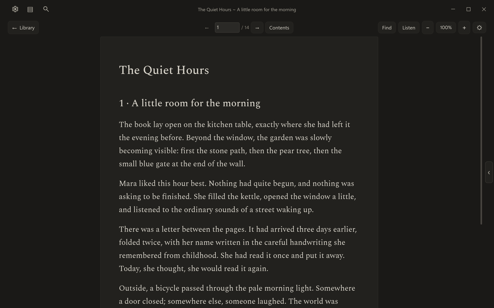
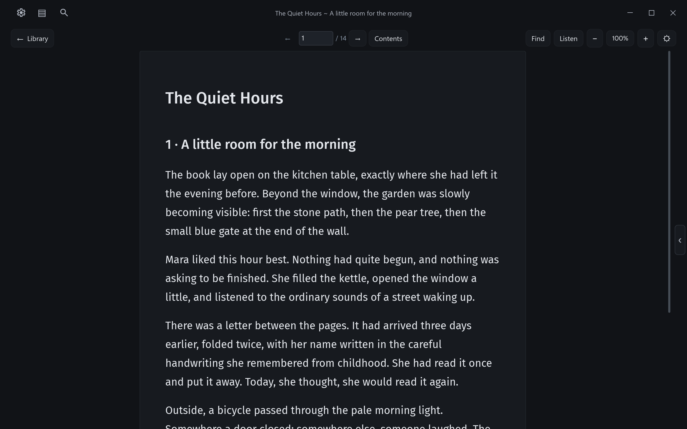
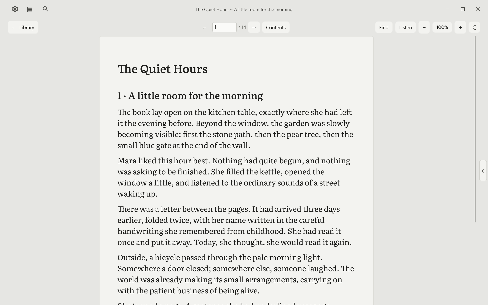
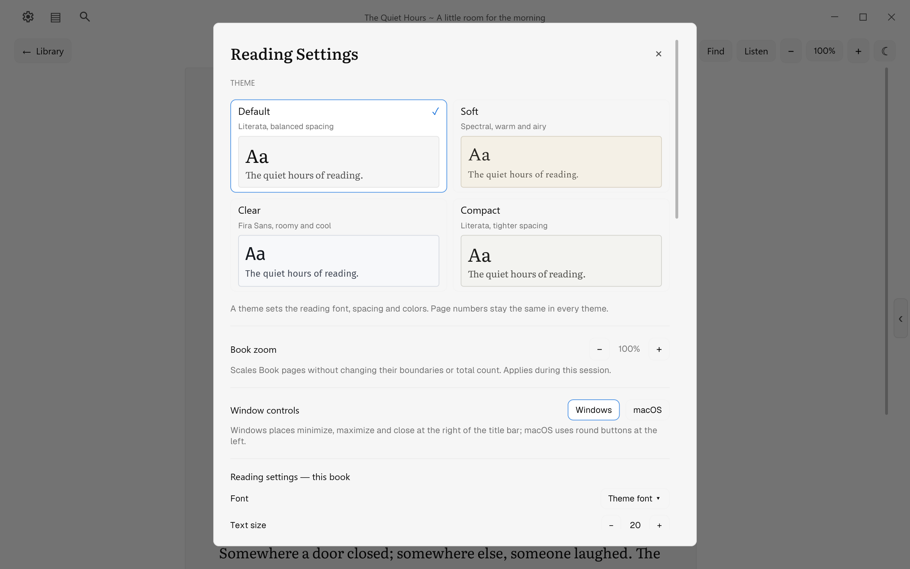
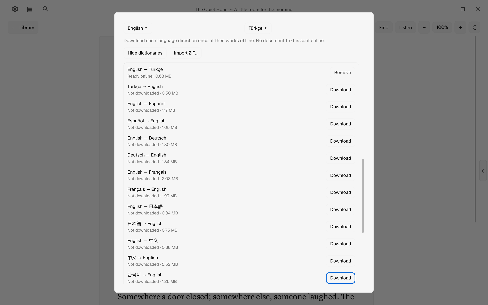
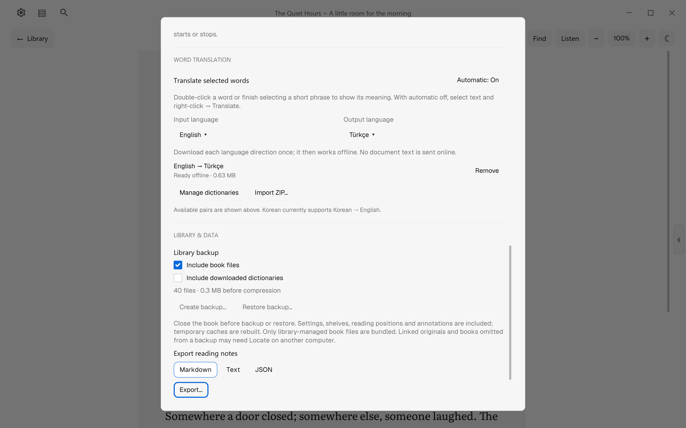

# simPl promotional media

22 full-window images, each **2560 × 1600** (16:10). PNG files preserve
the complete captured frame; `web/` contains pixel-identical, lossless WebP copies
at the same resolution. `reading-dark` is a compatibility alias for Default dark.

Use WebP on the website and PNG when editing or sharing originals. Suggested hero:
[Soft light](reading-soft-light.png) or [Default dark](reading-default-dark.png).
`manifest.json` provides captions, dimensions, byte sizes and SHA-256 hashes.

These images use simPl's production widgets, layout, fonts and tiny-skia renderer
at a 2× scale. The Windows native capture connection was unavailable in this
session, so these are **full-window application renders, not OS desktop captures**.
They contain no added controls, fake feature overlays or retouched interface.
The fullscreen image shows the application's fullscreen state; it does not
verify an OS fullscreen transition. Demo reading progress is saved through
actual page navigation. Listen's word marker comes from the installed Windows
SAPI engine (muted, then paused); the translation comes from the verified local
English → Turkish dictionary package.

The books, author names, prose, geometric covers and PDF artwork were created
for these demonstrations. They are not bundled with the reader and do not come
from a user's profile. Prepared for simPl's website, documentation and promotion.
The word-translation image and its preview in `overview.webp` include dictionary
data from **WikDict** (Karl Bartel), **Wiktionary contributors** via **DBnary**,
under [**CC BY-SA 4.0**](https://creativecommons.org/licenses/by-sa/4.0/).
simPl normalizes and excerpts this data. Keep the visible provider credit and
publish a linked attribution with these images; use [the ready-to-use HTML](attribution.html)
and [full image attribution](ATTRIBUTION.md). [Dictionary credits](dictionary-credits.md)
cover all downloadable directions. The existing [project license](project-license.md)
and third-party terms continue to apply to their respective material and do not
restrict CC-licensed dictionary content. This kit does not grant additional
rights to the simPl name or logo.

Required Notice: Copyright 2026 Tikkaaa3 (https://github.com/Tikkaaa3/simPl-reader)

## Gallery

| Preview | Description | Full PNG | WebP |
| --- | --- | --- | --- |
|  | Local library · light appearance | [PNG](library-light.png) | [WebP](web/library-light.webp) |
|  | Local library · dark appearance | [PNG](library-dark.png) | [WebP](web/library-dark.webp) |
|  | Default reading theme · light appearance | [PNG](reading-default-light.png) | [WebP](web/reading-default-light.webp) |
|  | Default reading theme · dark appearance | [PNG](reading-default-dark.png) | [WebP](web/reading-default-dark.webp) |
|  | Soft reading theme · light appearance | [PNG](reading-soft-light.png) | [WebP](web/reading-soft-light.webp) |
|  | Soft reading theme · dark appearance | [PNG](reading-soft-dark.png) | [WebP](web/reading-soft-dark.webp) |
|  | Clear reading theme · light appearance | [PNG](reading-clear-light.png) | [WebP](web/reading-clear-light.webp) |
|  | Clear reading theme · dark appearance | [PNG](reading-clear-dark.png) | [WebP](web/reading-clear-dark.webp) |
|  | Compact reading theme · light appearance | [PNG](reading-compact-light.png) | [WebP](web/reading-compact-light.webp) |
|  | Compact reading theme · dark appearance | [PNG](reading-compact-dark.png) | [WebP](web/reading-compact-dark.webp) |
|  | Bookmark, saved highlight and note sidebar | [PNG](notes-highlights.png) | [WebP](web/notes-highlights.webp) |
|  | Offline English → Turkish lookup for book | [PNG](word-translation.png) | [WebP](web/word-translation.webp) |
|  | Listen paused with the current spoken word retained | [PNG](listen-word-highlight.png) | [WebP](web/listen-word-highlight.webp) |
|  | Four reading themes and window control preferences | [PNG](theme-settings.png) | [WebP](web/theme-settings.webp) |
|  | Per-book font, text size, line spacing and side margins | [PNG](reading-settings.png) | [WebP](web/reading-settings.webp) |
|  | Optional dictionaries · installed pack and European languages | [PNG](dictionary-downloads.png) | [WebP](web/dictionary-downloads.webp) |
|  | Optional dictionaries · Japanese, Chinese and Korean | [PNG](dictionary-downloads-asian.png) | [WebP](web/dictionary-downloads-asian.webp) |
|  | Export bookmarks, highlighted quotes and notes | [PNG](backup-export.png) | [WebP](web/backup-export.webp) |
|  | Fullscreen reading with window chrome hidden | [PNG](reading-fullscreen.png) | [WebP](web/reading-fullscreen.webp) |
|  | Create or restore a library backup | [PNG](library-data.png) | [WebP](web/library-data.webp) |
|  | Original PDF page, typography and vector artwork | [PNG](pdf-document.png) | [WebP](web/pdf-document.webp) |
|  | The same PDF reconstructed in Book view | [PNG](pdf-book.png) | [WebP](web/pdf-book.webp) |

## Regenerate

On Windows with the repo's Rust/MSVC tools and Python with Pillow installed:

```powershell
.\scripts\capture-promotion.ps1
```

The script creates fresh fixtures and an isolated profile under `target/`, runs
the opt-in production render test, updates this media folder, verifies lossless
exports and README image paths, and writes a ZIP under `target/promotion/`.
It never changes the normal `%LOCALAPPDATA%\simPl` profile. Test helpers are
excluded from the shipped executable.
